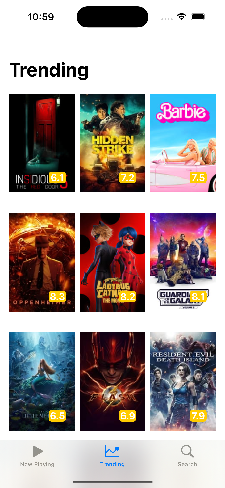
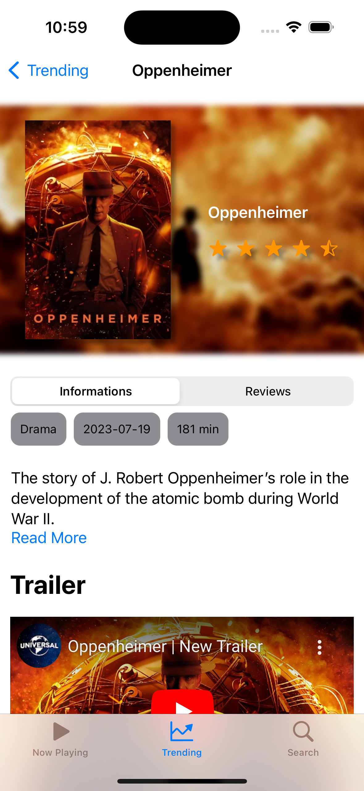
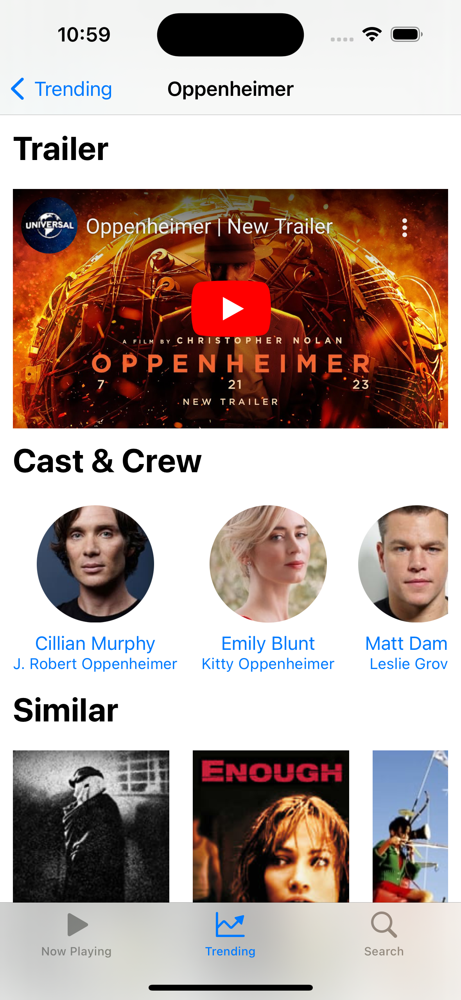
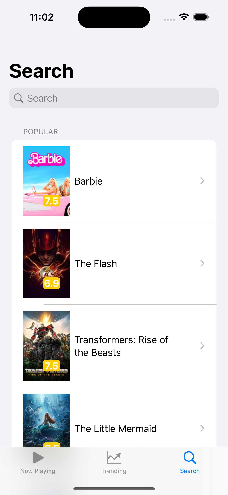

    <h1 align="center">Movie App</h1>

## About this project
This application allows users to explore and discover a vast collection of movies using the TMDB API. With the Movie App, users can stay up-to-date with the latest movie releases, search for their favorite films, explore detailed movie information, access reviews, and delve into the cast and crew details. Additionally, the app provides recommendations for similar movies, enhancing the user's movie-watching experience.

## Used Technology
- SwiftUI 📱
- WebKit 🌍
- Networking (Async/Await) 🌐
- TMDB API

## Features
1. **Latest Movie Updates**: The app provides users with real-time updates on the newest movie releases, ensuring they are always in the know about the latest cinematic offerings.

2. **Search and Browsing**: Users can easily search for movies by title, genre, or any other relevant criteria. The intuitive browsing experience allows users to quickly find the movies they're interested in.

3. **Detailed Movie Information**: Gain access to comprehensive movie details, including an overview of the plot, cast and crew information, release dates, and more.

4. **Reviews**: Explore user reviews and ratings for movies, helping users make informed decisions about what to watch next.

5. **Cast and Crew**: Discover the talented individuals behind the scenes and in front of the camera. Get insights into the cast and crew members who brought the movie to life.

6. **Similar Movies**: Receive recommendations for movies that are similar in theme, genre, or style to help expand your cinematic horizons.

## Screenshots

    
    
    
    

